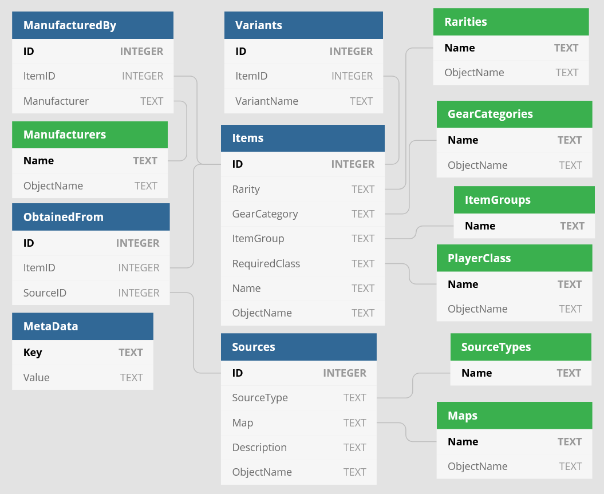

# BL3 Uniques DB Generator

This project generates a sqlite3 database holding information on all unique items in BL3, from the raw game data.

### [See this site to easily browse through the data](https://apple1417.dev/bl3/uniques).

## Schema

All the tables with green headers are just used as enums - you never really need to select from them, they're just used in foreign key constraints.

#### Misc Notes
Each item entry corosponds to exactly one `InventoryBalanceData`. Some balances can turn into what seems like multiple different items based on parts (e.g. Storm / Firestorm). These are actually the exact same item. The entry in the `Items` table picks one arbitrary name, then the `Variants` table stores the names of all the others.

Some items (grenades) can have multiple manufacturers, hence the seperate `ManufacturedBy` table.

Some enemies have their source's map field set to null, if they can spawn on multiple maps.

## Examples

The `demo` folder contains a bunch of examples of how to use this database.

Script | Usage
:---|:---
`enemy_maps.sql` | Lists the map each enemy is associated with.
`list_all_items.sql` | Lists all items in the database.
`list_all_sources.sql` | Lists all items alongside the sources you can get them from.
`list_variants.sql` | Lists all items names alongside their variant names.
`no_sources.sql` | Lists all items which don't have any sources.
`not_diamond_chest.sql` | Lists all items which cannot be obtained from the diamond chest.
`world_drops_only.sql` | Lists all items which can only be obtained from world drops.
`gen_hunt_sheet.py` (and `ghs_*.sql)`) | Generates a csv used as basis to create a sheet for the hunt. See the [final sheet here](https://docs.google.com/spreadsheets/d/1wwxGn2XY14qtANYcWDdREvZQzHU5c7_EGNXUQTjgW_o/edit?usp=sharing).
`gen_website_json.py` | Generates a json file used to fill [the browser site](https://apple1417.dev/bl3/uniques).
`util.py` | A few helpers for the other python scripts

## Generating the DB

#### Repo Setup
1. Extract the raw game data files - follow [this tutorial](https://github.com/BLCM/BLCMods/wiki/Accessing-Borderlands-3-Data#extracting-raw-datafiles) on the wiki
2. Download `bl3dump` from my [dataprocessing repo](https://github.com/apple1417/bl3-data-processing/tree/master/bl3dump) and put it in the base repo dir. Make sure to set it up to point to your extracted files.
3. Download the [bl3refs db](https://apocalyptech.com/games/bl3-refs/index.php), extract it, and put it in the base repo dir (or edit `util.py` to point to it's new location)
4. Install the [BL3 PythonSDK](https://github.com/bl-sdk/PythonSDK/tree/bl3) (note that it doesn't have a public release yet)
5. Copy `sdk/gen_dumps.py` into `<bl3>/OakGame/Binaries/Win64/Mods`

#### Generation
6. Launch the game without hotfixes
7. Open console and run `pyexec gen_dumps.py`
8. Copy `<bl3>/OakGame/Binaries/Win64/item_dumps.json` into the `sdk` folder
9. Run `generate.py`

If anything gets printed to `stdout`, or if any exceptions occur, then the game's likely been updated since the last time this project was. You'll have to manually update the some of the files in the `data` folder.
